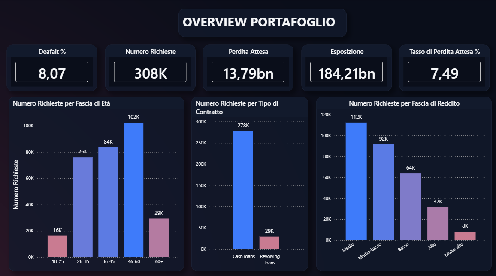
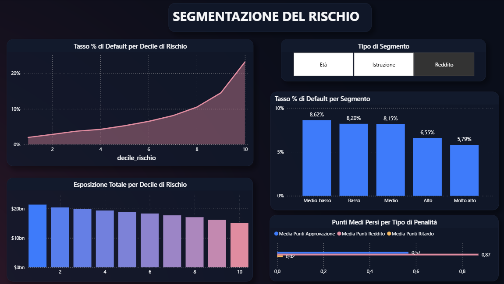
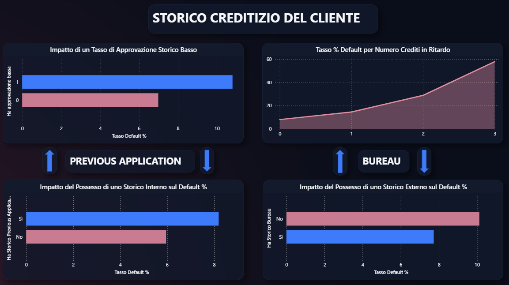
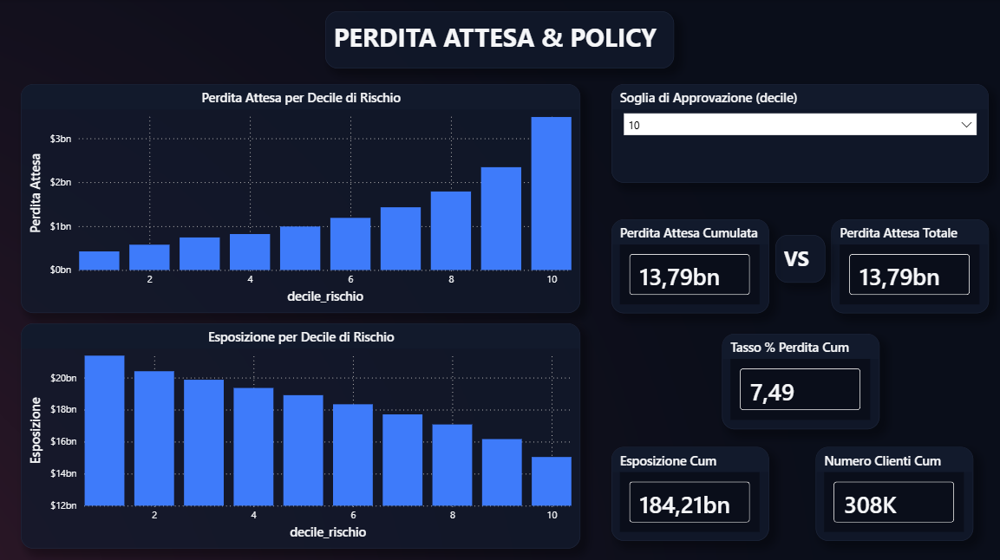
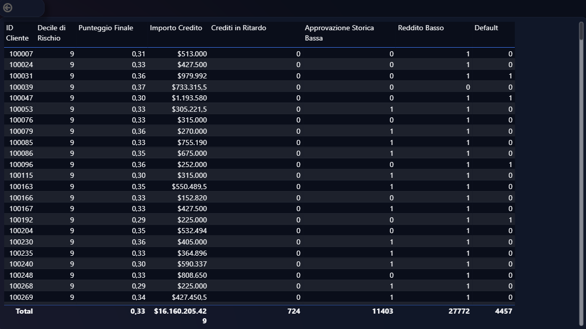

# Credit Risk Portfolio Analytics — Home Credit Default Risk

## 1. Sommario Esecutivo
Progetto di analisi del rischio di credito su un portafoglio di prestiti reale (Home Credit
Default Risk, Kaggle, ~307.500 richieste). L'obiettivo è segmentare i richiedenti per rischio
relativo, misurare quanto lo storico creditizio aggiunga segnale rispetto ai soli dati anagrafici,
e stimare la perdita attesa di portafoglio simulando diverse soglie di approvazione — usando uno
scoring a regole interamente in SQL (nessun modello di machine learning), con una dashboard Power
BI pronta per il management.

**Dataset**: [Home Credit Default Risk](https://www.kaggle.com/c/home-credit-default-risk/data)
(Kaggle). I CSV grezzi non sono inclusi in questo repository — scaricali dal link sopra ed
estraili in una cartella `sources/` nella root del repo per rieseguire la pipeline SQL in locale.
Il progetto usa deliberatamente solo 3 delle 9 tabelle disponibili (`application_train`, `bureau`,
`previous_application`): le altre (`installments_payments`, `credit_card_balance`,
`POS_CASH_balance`) sono state escluse perché il loro peso di elaborazione non era giustificato dal
valore aggiuntivo di segmentazione del rischio, dato lo scope del progetto.

---

## 2. Problema di Business
Un istituto di credito vuole rispondere a queste domande:
- Dove si concentra il rischio nel portafoglio prestiti attuale?
- Lo storico creditizio del cliente — esterno (altre banche, tramite il bureau) e interno
  (richieste precedenti presso lo stesso istituto) — aggiunge davvero valore segmentante, o basta
  il profilo anagrafico/reddituale?
- Qual è la perdita attesa del portafoglio, e come cambierebbe se si restringesse la soglia di
  approvazione?
- Quali segmenti di clientela (età, reddito, istruzione) hanno un tasso di default sistematicamente
  diverso dagli altri?

---

## 3. Metodologia
Il progetto segue un'architettura **Medallion (Bronze / Silver / Gold)** interamente in **SQL
Server**, con uno stack volutamente limitato a SQL + Power BI.

**Bronze** — ingestion grezza delle 3 tabelle, senza trasformazioni (tutte le colonne caricate come
`NVARCHAR`, per evitare corruzioni silenziose in fase di caricamento). Durante l'ingestion sono
emersi due bug reali, entrambi diagnosticati e risolti:
- un conflitto di locale sul separatore decimale che, con l'inferenza automatica dei tipi, aveva
  corrotto `EXT_SOURCE_2` e `DAYS_REGISTRATION` (valori come `203111956480` al posto di un numero
  fra 0 e 1) — risolto forzando `NVARCHAR` su ogni colonna in ingestion;
- valori categorici con virgola interna protetta da virgolette (es. `"Stone, brick"`,
  `"Spouse, partner"`) che, senza gestione del quoting, disallineavano ~74.000 righe (24%) facendo
  scivolare di una posizione tutte le colonne successive — risolto con `FORMAT='CSV', FIELDQUOTE='"'`
  nella `BULK INSERT`.

I controlli di qualità coprono duplicati sulle chiavi, null sulle colonne critiche, valori
sentinella (`DAYS_EMPLOYED = 365243` per i pensionati), outlier su `AMT_INCOME_TOTAL` (isolato con
un'analisi del gap fra i valori più alti via `LEAD`, non con la sola regola di Tukey — che da sola
avrebbe marchiato come outlier un intero segmento legittimo di redditi alti), e distinzione fra
placeholder di dato mancante (`XNA`) e placeholder di "non applicabile" (`XAP`).

**Silver** — pulizia e tipizzazione. I valori sentinella vengono trattati esplicitamente (flag
dedicato + `NULL`, mai reinterpretati come numero), i placeholder categorici mascherati da valore
valido vengono normalizzati a `NULL` solo dove l'analisi conferma che si tratta di dato mancante
(non dove sono strutturalmente frequenti, come `XNA` su colonne specifiche di
`previous_application`). Vengono creati due bucket di segmentazione (fascia età, fascia reddito),
usati poi come dimensioni nel layer Gold.

**Gold — il differenziatore tecnico del progetto**: `bureau` e `previous_application` hanno più
righe per cliente. Prima di unirle alla tabella principale, vengono aggregate per cliente con
`GROUP BY` e aggregazioni condizionali (`gold.bureau_aggregato`,
`gold.previous_application_aggregato`). Su questa base il layer Gold espone 5 view:

- `fact_application` — fact table, 1 riga = 1 richiesta, unisce `silver.application` allo storico
  aggregato con `LEFT JOIN` (non tutte le richieste hanno storico).
- `dim_borrower_segment` — dimensione con chiave surrogata (età / reddito / istruzione /
  abitazione).
- `risk_scoring` — punteggio composito che parte dalla media dei punteggi esterni di affidabilità
  (`EXT_SOURCE_1/2/3`), a cui si sottraggono punti di penalità dimensionati **verificando il tasso
  di default osservato reale per gruppo**, non assunti a priori: crediti bureau in ritardo
  (gradiente forte, con un tetto oltre il quale i gruppi diventano troppo piccoli per essere
  affidabili), tasso di approvazione storico nel 30% peggiore, fascia di reddito bassa. Due
  condizioni candidate (stato di pensionato, prestiti ancora aperti) sono state verificate e
  **escluse** perché l'effetto non era abbastanza forte o la direzione non era validata. Il
  punteggio finale è segmentato in decili con `NTILE(10)`, validato controllando che il tasso di
  default osservato cresca in modo monotono dal decile più sicuro al più rischioso.
- `confronto_segmenti` — `RANK`/`PERCENT_RANK` per confrontare il tasso di default fra fasce (età,
  reddito, istruzione), con classifica indipendente per ciascuna dimensione (`PARTITION BY`).
- `perdita_attesa` — tasso di default osservato × esposizione media per decile (assunzione
  dichiarata: tasso di recupero/LGD pari a zero, nessun dato di garanzie o recupero disponibile
  nello scope scelto), con totali progressivi calcolati con window function
  (`SUM(...) OVER (ORDER BY decile ROWS BETWEEN UNBOUNDED PRECEDING AND CURRENT ROW)`) per
  rispondere a "quale sarebbe la perdita attesa complessiva se approvassi solo fino al decile N?".

La **dashboard Power BI** è strutturata in 4 pagine — Overview Portafoglio, Segmentazione del
Rischio, Storico Creditizio del Cliente, Perdita Attesa & Policy — più una pagina di
drill-through, con dati esportati e importati come CSV (non connessione diretta a SQL Server) per
rendere il file autonomo e portabile.

---

## 4. Competenze Tecniche
| Area | Strumenti e Tecniche |
|---|---|
| Architettura dati | Medallion Architecture (Bronze/Silver/Gold), interamente in SQL Server |
| Trasformazione dati | T-SQL — CTE annidate, Window Functions (`NTILE`, `RANK`, `PERCENT_RANK`, running total con `ROWS BETWEEN`), `CASE WHEN`, aggregazione condizionale, `LEFT JOIN` con gestione NULL-safe |
| Qualità del dato | Diagnosi e correzione di bug reali di caricamento (locale/separatore decimale, CSV quoting), gestione di valori sentinella, distinzione dato mancante vs non applicabile, validazione empirica di ogni regola di scoring sul tasso di default osservato |
| Risk modeling | Scoring a regole (no ML), segmentazione a decili, simulazione soglia di approvazione, calcolo perdita attesa con assunzioni dichiarate |
| Reporting | Power BI — misure DAX, drill-through, tema custom condiviso con gli altri progetti del portfolio |

---

## 5. Risultati

### Overview Portafoglio
Il portafoglio analizzato conta **307.511 richieste di prestito**, con un tasso di default
complessivo dell'**8,07%**, un'esposizione totale di **184,21 miliardi** e una perdita attesa
stimata di **13,79 miliardi** (**7,49%** del portafoglio). La composizione è sbilanciata: la fascia
d'età 46-60 è la più numerosa (102K richieste), seguita da 36-45 (84K) e 26-35 (76K), mentre gli
estremi (18-25 e 60+) coprono insieme meno del 15% del totale. Sul reddito la fascia Medio è la più
rappresentata (112K), quella Molto alto la più rara (8K). I contratti Cash loans dominano
nettamente (278K) sui Revolving loans (29K, ~9,4%).

### Segmentazione del Rischio
Il punteggio di rischio a regole segmenta correttamente il portafoglio: il tasso di default cresce
in modo **perfettamente monotono** dal decile più sicuro al più rischioso — da **1,98%** (decile 1)
a **23,18%** (decile 10), un rapporto di quasi **12 volte** fra gli estremi. Fra i segmenti
demografici, le fasce di reddito basso/medio-basso/medio hanno un tasso di default simile fra loro
(8,1%-8,6%), chiaramente più alto delle fasce alto/molto alto reddito (5,8%-6,6%) — un pattern non
lineare, verificato sui dati prima di essere tradotto in regola di scoring. Scomponendo il
punteggio per tipo di penalità, il fattore che pesa mediamente di più è lo storico bureau (crediti
in ritardo), seguito dal reddito basso; il tasso di approvazione storico basso, pur avendo un
effetto forte quando presente, riguarda una quota minore di popolazione e pesa meno in media. Due
condizioni candidate (stato di pensionato, prestiti ancora aperti) sono state verificate e
**escluse** dal punteggio finale perché l'effetto non era abbastanza forte o la direzione non era
chiaramente validata.

### Storico Creditizio del Cliente
Il **85,7%** delle richieste ha almeno un credito storico presso il bureau esterno, il **94,6%** ha
almeno una richiesta precedente presso lo stesso istituto — la maggioranza del portafoglio è
arricchibile con storico. Lo storico aggiunge segnale reale: il tasso di default cresce da **8%**
(nessun credito bureau in ritardo) a oltre **60%** (3 o più crediti in ritardo), un gradiente molto
più marcato di quanto qualunque singola variabile demografica mostri da sola. Anche solo
**possedere** uno storico bureau è un segnale: chi ne ha uno mostra un tasso di default più basso
(~7,5%) di chi non ne ha nessuno (~10%), verosimilmente perché un cliente "thin file" è
intrinsecamente più incerto da valutare. Sul fronte interno, il tasso di approvazione storico
mostra invece un effetto soglia: solo il 30% peggiore della distribuzione è associato a un rischio
significativamente più alto (fino all'11%+ nei decili peggiori), il resto è sostanzialmente piatto
attorno al 7%. Curiosamente, avere già una richiesta precedente (a prescindere dall'esito) è
associato a un tasso di default leggermente più alto (~8,5%) di chi non ne ha mai fatta una (~6%).

### Perdita Attesa & Policy
L'esposizione media per decile **scende** dal più sicuro al più rischioso (i clienti più rischiosi
tendono a chiedere importi più piccoli, forse per auto-selezione o per underwriting già applicato
da Home Credit), ma il tasso di default cresce molto più velocemente — quindi la perdita attesa per
cliente sale comunque di circa **8 volte** dal decile più sicuro al più rischioso. La simulazione
di soglia di approvazione (con totali progressivi per ogni decile) quantifica, per ciascun possibile
taglio, il compromesso fra perdita attesa complessiva e volume di clienti approvati: restringere
l'approvazione ai decili più sicuri riduce la perdita attesa cumulata più che proporzionalmente
rispetto al numero di clienti esclusi, dato che il rischio non è distribuito uniformemente. Tutte le
stime assumono un tasso di recupero (LGD) pari a zero — un'assunzione conservativa dichiarata
esplicitamente, dato che lo scope dati scelto non include informazioni su garanzie o importi
effettivamente recuperati dopo un default.

---

## 6. Prossimi Passi
- Integrare `installments_payments` per stimare un tasso di recupero (LGD) reale invece
  dell'assunzione conservativa attuale (LGD = 100%)
- Estendere il confronto segmenti ad altre dimensioni (tipo di occupazione, tipo di abitazione)
- Automatizzare il refresh della pipeline SQL e l'aggiornamento dei CSV sorgente della dashboard

---

## Dashboard Preview

### Overview Portafoglio

### Segmentazione del Rischio

### Storico Creditizio del Cliente

### Perdita Attesa & Policy

### Dettaglio Cliente (drill-through)
Pagina raggiungibile con un clic destro su un grafico della Pagina 2 ("Analisi dettagliata") —
mostra il dettaglio riga per riga dei clienti nel decile/segmento selezionato.

## Come utilizzare la Dashboard

Per esplorare la dashboard in modo interattivo, scaricare il file `.pbix` dalla cartella
`powerbi/` e aprirlo con **Power BI Desktop** (scaricabile gratuitamente da
[qui](https://powerbi.microsoft.com/it-it/desktop/)). I dati sono già incorporati nel file (CSV
importati, non connessione live a SQL Server) — non è necessario installare SQL Server o
scaricare file aggiuntivi.

---

## Autore
**Mattia Falco**
- LinkedIn: www.linkedin.com/in/mattia-falco-4b8b3033b
- GitHub: https://github.com/Mattia2220
